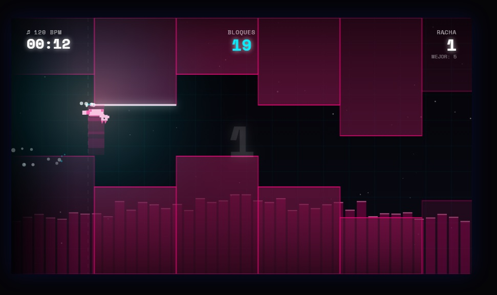

# 🌌 Gravity Runner

**Gravity Runner** es un adictivo juego de ritmo y plataformas desarrollado en HTML5 Canvas y JavaScript puro. Esquiva bloques a velocidades frenéticas mientras la música dicta el pulso del mundo.



## 🚀 Características Principales

- **Mecánica de Gravedad Única**: Controla a tu personaje con una sola tecla. Mantén pulsado para descender y suelta para ascender. ¡La precisión es la clave!
- **Sistema de Música Personalizada**: Sube tus propios archivos MP3/WAV. El juego incluye un **analizador de audio integrado** que detecta automáticamente el BPM (ritmo) de tu música para generar niveles sincronizados.
- **8 Personajes Coleccionables**:
  - **CUBE**: El clásico minimalista.
  - **CAT**: Un gato con animaciones de carrera detalladas.
  - **FOX**: Un zorro veloz con una estela de neón y bufanda de luz.
  - **DRONE**: Un núcleo mecánico flotante con alas rotatorias.
  - **GHOST**: Un espectro semi-transparente que flota con elegancia.
  - **UFO**: Una nave espacial con luces que reaccionan a la música.
  - **NINJA**: El guerrero sombrío con una bufanda infinita.
  - **SHARK**: Un depredador de neón que surca los bloques.
- **Estética Cyber-Neon**: Colores dinámicos que cambian según el volumen de la música, fondos con cuadrículas retro y efectos de partículas premium.
- **Persistencia**: Tus niveles creados y mejores puntuaciones se guardan automáticamente en el navegador (`LocalStorage`).

## 🎮 Cómo Jugar

1.  **Menú**: Selecciona una canción de la lista o crea una nueva subiendo un archivo de audio.
2.  **Controles**:
    *   **MANTENER (Cualquier tecla)**: El personaje baja hacia el suelo.
    *   **SOLTAR**: El personaje sube hacia el techo.
    *   **ESPACIO / P**: Pausar el juego.
3.  **Objetivo**: Esquiva los bloques superiores e inferiores. Mantener una racha perfecta (Streak) aumentará tu porcentaje de precisión final.

## 🛠️ Instalación y Uso

No requiere instalación. Solo clona el repositorio y abre el archivo `index.html` en cualquier navegador moderno.

```bash
git clone https://github.com/tu-usuario/gravity-runner.git
cd gravity-runner
# Abre index.html en tu navegador
```

## 📜 Tecnologías Utilizadas

- **HTML5 Canvas**: Motor de renderizado 2D de alto rendimiento.
- **Web Audio API**: Para el procesamiento de sonido en tiempo real y análisis de BPM.
- **Vanilla JavaScript**: Lógica de juego pura sin dependencias externas.
- **CSS3**: Diseño de interfaces con Glassmorphism y tipografía moderna (Space Mono).

## 📄 Licencia

Este proyecto es de código abierto. ¡Siéntete libre de mejorarlo o añadir nuevos personajes!

---
Desarrollado con ❤️ para amantes del ritmo y la velocidad.
